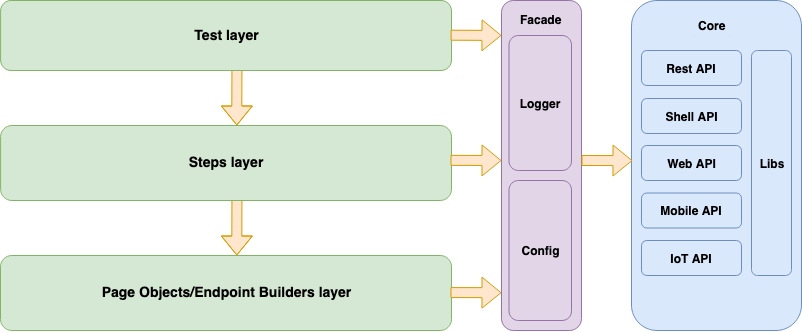
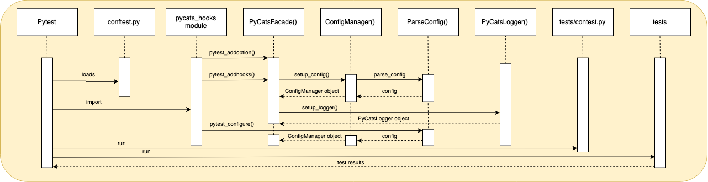

# PyCats (Python Common Automation Test Solution)
The PyCats aims to provide the well-structured framework with libraries created based on the popular python solutions intended for testing purposes and to make it universal for testing across different domain areas - Web, Mobile, IoT, Embedded.

It uses the [pytest](https://docs.pytest.org/en/latest/ "pytest") library as a test runner, [Selenium Web Driver](https://www.selenium.dev/projects/ "Selenium Web Driver") for Web UI testing, [Appium](http://appium.io/ "Appium") for mobile testing (Coming Soon), contains wrappers over the Web Driver to simplify its usage, provides layered architecture and recommendations how to organize tests.

### Architecture
PyCATS is implemented base on the layered architecture approach that allows which allows you to differentiate the functionality of tests and modules into different layers and make the use of the framework simple and understandable.

The following diagram displays how it looks like (you can find the examples of how the tests and layers are organized in the project folder):
 


The sequence diagram below illustrates how PyCATS performs initial framework initialization based on the pytest hooks



## Getting Started

TBU

### Requirements

The minimal python version is 3.7

To enable Web UI testing, need to download Web drivers for your browsers versions and provide their names and path to the directory via a configuration file or command-line interface:

[Chrome Drivers](https://chromedriver.chromium.org/downloads "Chrome Drivers")
[Firefox Drivers](https://github.com/mozilla/geckodriver/releases "Firefox Drivers")
[Microsof Edge](https://developer.microsoft.com/en-us/microsoft-edge/tools/webdriver/ "Microsoft Edge")
Safari Drivers are delivered together with browser

PyCats uses WebDriver's RemoteDriver to be able to run a browser remotely. You need to download [selenium server](https://www.selenium.dev/downloads/ "selenium server") and provide its path in the configuration file.


### Installation

To install the required packages, download GitHub project and execute the following command in the root project's directory:

```bash
pip3 install -r requirements.txt
```

### Configuration
##### Setup Config
Create directory for configs and prepare the config ini file started with `pycats_` prefix and `.ini` extension, like:  `pycats_config.ini`:

Example of `pycats_config.ini`:
```
[global]
;Path to folder to keep the log files. Folder will be created if if does not exist. Logs by default
logdir = Logs
;Log level. The same for all streams. INFO by default 
log_level = INFO
; If True, the logging from 3-d party libraries like Selenium, requests, etc, will be included in log file. True by default
enable_libs_logging = True

[api_validation]
;Should the API validator verify response status code. True by default
validate_status_code = True
;Should the API validator verify response headers. True by default
validate_headers = True
;Should the API validator verify response body. (default is True)
validate_body = True
;Should the API validator raise exception if some field from model is absent in response. True by default
validate_is_field_missing = True

[web]
;Folder where browsers drivers are located
webdriver_folder = /home/test/web/webdrivers/
;Time to wait until element appears on the page. 20 seconds by default
webdriver_default_wait_time = 20
;Webdriver implicit wait time. 60 seconds by default
webdriver_implicit_wait_time = 60
;Folder where selenium server is located
selenium_server_executable = /home/test/web/webdrivers/selenium-server-standalone-3.141.59.jar
;Chrome driver filename
chrome_driver_name = chromedriver
;Firefox driver filename
firefox_driver_name = gecodriver
;Browser to use in a testing (depending on this field value - appropriate driver name will be looked up in webdriver_folder)
browser = chrome
```

`global` and `api_validation` sections are optional but you can override their default behaviour in config. 

The mandatory settings for `web` section are:
- `webdriver_folder`
- `chrome_driver_name`
- `firefox_driver_name`
- `browser`

##### Setup pytest.ini
Create `pytest.ini` file in the root directory with the following content:
```
[pytest]
config_dir = ./config
```

where `config_dir` is absolute or relative path to configs directory.  

##### Add custom sections
PyCats configuration system allows users to extend default config file or split it to multiple and load them dynamically.
Specify necessary configuration options like application url or api url in custom section of config file:

Example of `pycats_config.ini`:
```
[project]
web_app_url = https://openweathermap.org/
web_api_url = http://api.openweathermap.org/data/2.5/
```

then write section description class in the same config folder or subfolders. It should be inherited from 
`common.config_parser.config_parser.ConfigSection` class and implement all necessary abstract methods.
See example in `config/project_section.py`
 

#### Access Facade API

To access Facade API you can use shortcut from common.facade.\_\_init__.py

```python
from common.facade import raw_config, logger
```

- `raw_config` -  shortcut to access pycats.config_manager.config object from Facade
- `logger` -  shortcut to access pycats.logger object from Facade

## Writing UI tests
TBU

## Writing API  tests

The PyCats's API testing main feature is the ability to use models to validate request/response automatically on the core level without test layer impact.
On the tests layer it is needed to prepare a response model and specify expected conditions, and the system does the rest for you.

Detailed description and example you can find on wiki page: [Writing API tests](https://github.com/Softeq/PyCats/wiki/Writing-API--tests "Writing API tests")


## License

This project is licensed under the Apache2 License - see the [LICENSE](LICENSE) file for details
